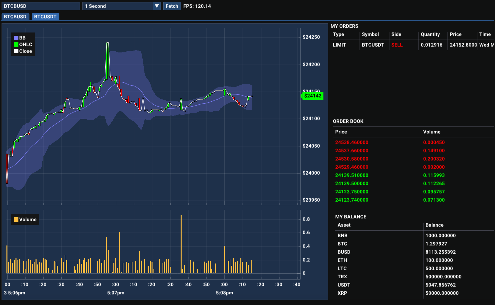

# ATS
ATS is an open-source implementation of an algorithmic trading systems library in C++.

It currently supports the Binance Exchange but the project is modular and any exchange can be added.



## Prerequisites
The project requires C++ 17 and CMake.

Submodules include [binance-cxx-api](https://github.com/dmikushin/binance-cxx-api), [GoogleTest](https://github.com/google/googletest) and their dependencies.

## Quick Start Overview
### Cloning
```bash
git clone --recurse-submodules -j4 https://github.com/anouarac/ATS.git
```
### Building
```bash
$ cd ATS
$ mkdir build
$ cd build
```
##### Windows
```Bash
$ cmake-gui ..
```
Then generate the binaries in the build directory.
##### Linux/Mac
```Bash
$ cmake ..
$ make -j4
```

You should now be able to run the targets either through an IDE such as Visual Studio, or through the terminal.

### Example
Working with this library can go as follows with the Binance EMS:

* Place Binance Spot Net API keys in ```$HOME/.binance/key``` and ```$HOME/.binance/secret```, or ```$HOME/.binance/test_key``` and ```$HOME/.binance/test_secret```for the Spot Test Net.
* Import the following libraries 
  ```CPP
  #include <iostream>
  #include "ats.h"
  #include "json/json.h"
  #include "binance_logger.h"
  ```
* Setup Logger
  ```CPP
  binance::Logger::set_debug_level(1);
  binance::Logger::set_debug_logfp(stderr);
  ```
* Initialise OMS and Binance EMS
  ```CPP
  ats::OrderManager oms;
  ats::BinanceExchangeManager b_ems(oms, 1);
  ```
* Interact with EMS
  ```CPP
  Json::Value result;
  b_ems.getUserInfo(result);
  std::cout << result.toStyledString() << std::endl;
  std::cout << b_ems.getPrice("ETHUSDT") << std::endl;
  ```
You can find more examples in [examples](examples/).
## Documentation
For further details check the [documentation](https://anouarac.github.io/ATS/).
